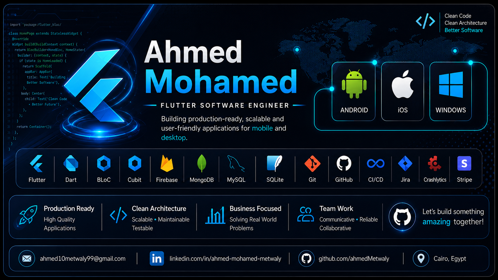

 

# 👋 About Me

Flutter Software Engineer with hands-on experience building production-ready Mobile and Windows Desktop applications.

Passionate about building scalable software using Clean Architecture, BLoC, modern development practices, and creating business solutions that solve real-world problems.

I enjoy transforming complex requirements into fast, maintainable and user-friendly applications.

---

# 🚀 Featured Projects

## 🚢 Freight In

> Enterprise logistics platform.

### Highlights

- Sea & Air Freight
- Shipment Tracking
- CMA CGM Integration
- Route Finder
- Trucking Cost Calculator
- OpenStreetMap
- CBM Calculator
- Tariff Lookup
- Firebase Analytics
- Crashlytics
- Deep Linking
- PDF Generation
- Arabic & English
- Clean Architecture
- BLoC

📱 Google Play
 

---

## 🏭 El-Ehsan Factory ERP

### Highlights

- Inventory Management
- Supplier Management
- Customer Management
- Employee Management
- Financial System
- Reports
- PDF Export
- Workflow Tracking
- Analytics
- MySQL
- Clean Architecture
- MVVM
- BLoC

---

## 🏢 FTL Group ERP

Enterprise business management system.

### Modules

- Authentication
- HR Management
- Attendance
- CRM
- Sales
- Finance
- Operations
- Office Management
- Reports
- Employee Permissions
- API Integration
- Multi Department Workflow

---

## 🚗 Eagle Parking

Garage Management Platform.

### Features

- Windows Application
- Android App
- iOS App
- Live Monitoring
- Firebase
- Ticket Printing
- Reports
- Employee Management
- Real-time Updates

---

# ⚙️ Tech Stack

---

# 💻 Technical Skills

### Languages

- Dart

### Frameworks

- Flutter

### Platforms

- Android
- iOS
- Windows

### Architecture

- Clean Architecture
- MVVM
- SOLID Principles
- Repository Pattern
- Dependency Injection

### State Management

- BLoC
- Cubit

### Backend & Database

- Firebase
- MongoDB
- MySQL
- SQLite
- Shared Preferences
- Secure Storage

### Networking

- REST APIs
- Dio
- Retrofit

### Services

- Firebase Analytics
- Crashlytics
- Firebase Cloud Messaging
- Stripe

### Tools

- Git
- GitHub
- CI/CD
- Jira
- Android Studio
- VS Code
- FVM
- Postman

---

# 🤝 Soft Skills

- Leadership
- Communication
- Teamwork
- Project Management
- Creative Thinking
- Decision Making
- Presentation Skills

---

# 🏆 Certifications

- Flutter BLoC State Management
- Dart Programming & OOP
- First Rank – AI Competition (Osnabrück University)

---

# 📫 Contact

---

## Thanks for visiting my profile ❤️

*"Building software that solves real-world business problems."*

